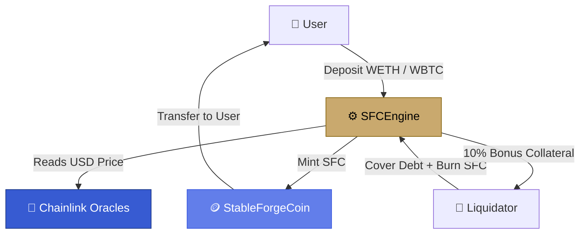
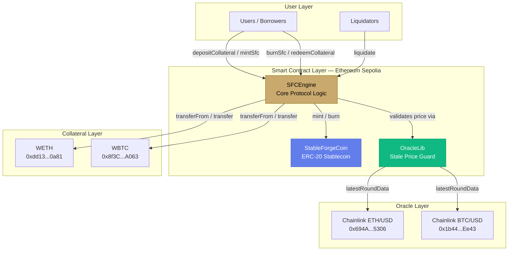
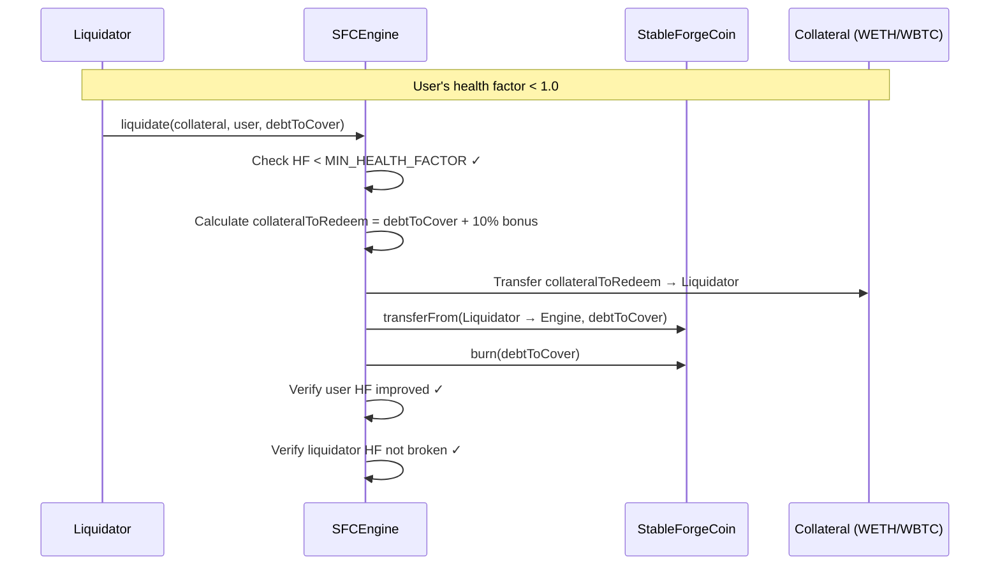

# StableForge Protocol

**Decentralized, Overcollateralized Stablecoin on Ethereum**

StableForge is a decentralized stablecoin protocol that allows users to mint **SFC** (StableForge Coin) — a USD-pegged stablecoin — by locking WETH or WBTC as collateral. Inspired by MakerDAO's DAI, it operates without governance, without fees, and with a fully automated on-chain liquidation engine secured by Chainlink price feeds.

**Deployed Status:** ✅ Live on Ethereum Sepolia  
**Solidity Version:** `^0.8.18`  
**Test Framework:** Foundry  
**Audit Status:** Pre-audit (testnet phase)

---

## Table of Contents

- [Executive Summary](#executive-summary)
- [Protocol Flow](#protocol-flow)
- [System Architecture](#system-architecture)
- [Smart Contracts](#smart-contracts)
- [SFCEngine.sol](#sfcenginesol)
- [StableForgeCoin.sol](#stableforgecoinsol)
- [Economic Model](#economic-model)
- [Liquidation Mechanism](#liquidation-mechanism)
- [Oracle Security](#oracle-security)
- [Live Application](#live-application)
- [Quick Start](#quick-start)
- [Testing](#testing)
- [Security Considerations](#security-considerations)
- [Development Roadmap](#development-roadmap)
- [Technical Stack](#technical-stack)
- [FAQ](#faq)
- [Contributing](#contributing)
- [License](#license)

---

## Executive Summary

**What:** StableForge is a crypto-collateralized, USD-pegged stablecoin protocol  
**Why:** Existing stablecoin systems rely on governance, fees, or centralized issuers — StableForge removes all of that  
**How:** Users over-collateralize with WETH/WBTC at 200%, mint SFC up to 50% of collateral value, and an open liquidation market enforces solvency

**Core Invariant:** At all times, the total collateral value locked in the protocol must exceed the total SFC in circulation.

---

## Protocol Flow



---

## System Architecture



---

## Smart Contracts

| Contract          | Address (Sepolia)                                                                                                               | Purpose                                               | Status      |
| ----------------- | ------------------------------------------------------------------------------------------------------------------------------- | ----------------------------------------------------- | ----------- |
| `SFCEngine`       | [`0xb3aaed6233f01d0b77ec265a7bdfce83e71bf9f1`](https://sepolia.etherscan.io/address/0xb3aaed6233f01d0b77ec265a7bdfce83e71bf9f1) | Core protocol: deposit, mint, redeem, burn, liquidate | ✅ Deployed |
| `StableForgeCoin` | [`0x98b1383944e6058643183a842578c4df0d096245`](https://sepolia.etherscan.io/address/0x98b1383944e6058643183a842578c4df0d096245) | ERC-20 USD-pegged stablecoin (SFC)                    | ✅ Deployed |

**Network:** Ethereum Sepolia Testnet  
**Chain ID:** `11155111`  
**RPC:** `https://rpc.sepolia.org`  
**Explorer:** https://sepolia.etherscan.io

**Accepted Collateral & Price Feeds:**

| Token | Address                                      | Price Feed | Feed Address                                 |
| ----- | -------------------------------------------- | ---------- | -------------------------------------------- |
| WETH  | `0xdd13E55209Fd76AfE204dBda4007C227904f0a81` | ETH / USD  | `0x694AA1769357215DE4FAC081bf1f309aDC325306` |
| WBTC  | `0x8f3Cf7ad23Cd3CaDbD9735AFf958023239c6A063` | BTC / USD  | `0x1b44F3514812d835EB1BDB0acB33d3fA3351Ee43` |

---

## SFCEngine.sol

**Purpose:** The brain of the protocol. Handles all collateral accounting, SFC minting/burning, health factor enforcement, and liquidations.

**Key Protocol Constants:**

| Constant                    | Value          | Description                               |
| --------------------------- | -------------- | ----------------------------------------- |
| `LIQUIDATION_THRESHOLD`     | `50`           | Max 50% of collateral value may be minted |
| `LIQUIDATION_BONUS`         | `10`           | Liquidators receive 10% bonus collateral  |
| `MIN_HEALTH_FACTOR`         | `1e18` (= 1.0) | Minimum health factor before liquidation  |
| `ADDITIONAL_FEED_PRECISION` | `1e10`         | Scales Chainlink's 8-decimal price to 18  |
| `MAX_PRICE_AGE`             | `3 hours`      | Maximum age of accepted oracle price      |

### State Variables

| Variable               | Type                                              | Description                                  |
| ---------------------- | ------------------------------------------------- | -------------------------------------------- |
| `sPriceFeeds`          | `mapping(address => address)`                     | Maps collateral token → Chainlink price feed |
| `sCollateralDeposited` | `mapping(address => mapping(address => uint256))` | User → Token → Amount deposited              |
| `sSfcMinted`           | `mapping(address => uint256)`                     | User → SFC minted (outstanding debt)         |
| `sCollateralTokens`    | `address[]`                                       | List of accepted collateral tokens           |
| `I_SFC`                | `StableForgeCoin`                                 | Immutable reference to SFC token             |

### Core Functions

#### Write Functions

**`depositCollateral(address token, uint256 amount)`**  
Deposits ERC-20 collateral into the engine. Emits `CollateralDeposited`.

**`mintSfc(uint256 amount)`**  
Mints SFC against deposited collateral. Reverts if health factor would fall below 1.0.

**`depositCollateralAndMintSfc(address token, uint256 collateralAmount, uint256 mintAmount)`**  
Combines deposit + mint in a single transaction.

**`burnSfc(uint256 amount)`**  
Burns SFC from the caller's wallet, reducing their debt.

**`redeemCollateral(address token, uint256 amount)`**  
Withdraws collateral. Reverts if health factor would break after withdrawal.

**`redeemCollateralForSfc(address token, uint256 collateralAmount, uint256 burnAmount)`**  
Combines burn + redeem in a single transaction.

**`liquidate(address collateral, address user, uint256 debtToCover)`**  
Allows anyone to liquidate an undercollateralized position, receiving a 10% bonus.

#### View Functions

**`getHealthFactor(address user) → uint256`**  
Returns the user's current health factor (1e18 = 1.0). Returns `type(uint256).max` if no debt.

**`getAccountInformation(address user) → (uint256 totalDscMinted, uint256 collateralValueInUsd)`**  
Returns the user's total debt and total collateral value in USD (18 decimals).

**`getAccountCollateralValue(address user) → uint256`**  
Returns total USD value of a user's collateral across all accepted tokens.

**`getUsdValue(address token, uint256 amount) → uint256`**  
Returns the USD value of a given token amount using Chainlink price feed.

**`getTokenAmountFromUsd(address token, uint256 usdAmountInWei) → uint256`**  
Inverse: returns how much of a token corresponds to a given USD amount.

**`getCollateralBalanceOfUser(address user, address token) → uint256`**  
Returns how much of a specific collateral a user has deposited.

### Events

```solidity
event CollateralDeposited(address indexed user, address indexed token, uint256 amount);
event CollateralRedeemed(address indexed redeemedFrom, address indexed redeemedTo, address indexed token, uint256 amount);
```

### Health Factor Formula

```
collateralAdjustedForThreshold = (collateralValueInUsd × LIQUIDATION_THRESHOLD) / LIQUIDATION_PRECISION
                                = collateralValueInUsd × 50 / 100
                                = collateralValueInUsd / 2

healthFactor = (collateralAdjustedForThreshold × 1e18) / totalDscMinted
```

**Example:**

```
Collateral: $200 WETH
SFC Minted: $80

collateralAdjusted = $200 × 50 / 100 = $100
healthFactor = ($100 × 1e18) / ($80 × 1e18) = 1.25 ✅ Safe
```

---

## StableForgeCoin.sol

**Purpose:** The SFC ERC-20 token. Ownership is transferred to SFCEngine at deployment — only the engine can mint or burn.

**Token Details:**

| Property | Value                             |
| -------- | --------------------------------- |
| Name     | `StableForge Coin`                |
| Symbol   | `SFC`                             |
| Decimals | `18`                              |
| Owner    | `SFCEngine`                       |
| Supply   | Dynamic (minted/burned on demand) |

**Key Functions:**

**`mint(address to, uint256 amount) → bool`** — Only callable by SFCEngine. Mints new SFC to a user.  
**`burn(uint256 amount)`** — Only callable by SFCEngine. Burns SFC from engine's balance (transferred there during burn flow).

---

## Economic Model

### Collateral Ratio

The protocol enforces a **200% minimum collateral ratio** at all times:

```
To mint $100 SFC  →  Must lock ≥ $200 in collateral
Maximum LTV       →  50% (Loan-to-Value)
```

### Position Example

| Action               | Collateral | SFC Minted | Health Factor        |
| -------------------- | ---------- | ---------- | -------------------- |
| Deposit $1,000 WETH  | $1,000     | $0         | ∞                    |
| Mint $400 SFC        | $1,000     | $400       | 1.25                 |
| ETH drops 20% → $800 | $800       | $400       | 1.00 ⚠️              |
| ETH drops 21% → $790 | $790       | $400       | 0.99 ☠️ Liquidatable |

### Fee Structure

| Action                            | Fee                  |
| --------------------------------- | -------------------- |
| Deposit collateral                | Free                 |
| Mint SFC                          | Free                 |
| Burn SFC                          | Free                 |
| Redeem collateral                 | Free                 |
| Liquidation bonus (to liquidator) | +10% of covered debt |

StableForge charges **zero protocol fees**. The only cost to users is gas.

---

## Liquidation Mechanism

When a user's health factor drops below `1.0`, anyone can liquidate them.

### How Liquidation Works



### Liquidation Example

```
User position:
  WETH collateral:    $140
  SFC debt:           $100
  Health Factor:      0.70 ☠️

Liquidator covers full $100 debt:
  Collateral to receive = $100 + 10% = $110 WETH
  Liquidator profit     = $10
  User remaining        = $140 - $110 = $30 WETH collateral, $0 debt
```

**Partial liquidations are supported** — liquidators can cover any portion of the debt.

---

## Oracle Security

StableForge uses a custom `OracleLib` library to validate every Chainlink price read. A raw `latestRoundData()` call is never used directly.

### Validation Checks (per price read)

```solidity
if (price <= 0)                          revert SFCEngine__OraclePriceInvalid();
if (answeredInRound < roundId)           revert SFCEngine__OracleRoundIncomplete();
if (block.timestamp - updatedAt > 3 hours) revert SFCEngine__OraclePriceStale();
```

| Check                       | Guards Against                     |
| --------------------------- | ---------------------------------- |
| `price <= 0`                | Negative or zero price from oracle |
| `answeredInRound < roundId` | Incomplete round data              |
| `updatedAt > 3 hours ago`   | Stale or frozen price feed         |

If any check fails, **the entire transaction reverts** — no action can be taken with a stale or invalid price, protecting users from bad liquidations and under-collateralized mints.

---

## Live Application

**🌐 Frontend:** _(currently under development)_

### Pages

| Page         | Description                                                                      |
| ------------ | -------------------------------------------------------------------------------- |
| `/`          | Landing page — protocol overview                                                 |
| `/dashboard` | Your position: collateral, SFC minted, health factor, liquidation price          |
| `/deposit`   | Deposit WETH or WBTC (optionally mint SFC in same tx)                            |
| `/mint`      | Mint SFC against existing collateral                                             |
| `/burn`      | Burn SFC to reduce debt                                                          |
| `/redeem`    | Redeem collateral (optionally burn SFC in same tx)                               |
| `/liquidate` | Browse at-risk positions, execute liquidations with 10% bonus                    |
| `/users`     | All protocol users indexed from on-chain events, with clickable position details |

**Frontend Stack:** Next.js 15, Wagmi v2, RainbowKit, Viem, TypeScript, Tailwind CSS

---

## Quick Start

### Prerequisites

- [Foundry](https://book.getfoundry.sh/getting-started/installation) (forge, cast, anvil)
- Node.js 18+
- Git

### Clone & Install

```bash
git clone https://github.com/1khushibarnwal/StableForge.git
cd StableForge
forge install
```

### Environment Setup

Create a `.env` file:

```env
SEPOLIA_RPC_URL=https://rpc.sepolia.org
PRIVATE_KEY=your_private_key_here
ETHERSCAN_API_KEY=your_etherscan_api_key
```

### Build Contracts

```bash
forge build
```

### Run Tests

```bash
forge test
```

### Run Tests with Verbosity

```bash
forge test -vvvv
```

### Deploy to Sepolia

```bash
forge script script/DeploySFC.s.sol:DeploySFC \
  --rpc-url $SEPOLIA_RPC_URL \
  --private-key $PRIVATE_KEY \
  --broadcast \
  --verify \
  -vvvv
```

### Run Local Frontend

```bash
cd frontend   # or stableforge-frontend
npm install
npm run dev
# Open http://localhost:3000
```

---

## Testing

### Run All Tests

```bash
forge test
```

### Run with Gas Reports

```bash
forge test --gas-report
```

### Run Specific Test File

```bash
forge test --match-path test/unit/SFCEngineTest.t.sol -vvvv
```

### Test Coverage

```bash
forge coverage
```

### What's Tested

- ✅ Collateral deposit and accounting
- ✅ SFC minting within allowed limits
- ✅ Health factor calculation correctness
- ✅ Liquidation execution and bonus math
- ✅ Revert on broken health factor
- ✅ Oracle stale price revert
- ✅ Burn and redeem flows
- ✅ Combined deposit+mint and redeem+burn transactions
- ✅ Constructor validation (token/feed length mismatch)
- ✅ Zero-amount reverts across all functions

---

## Security Considerations

### Known Limitations

**1. No Governance / Emergency Pause**

- ⚠️ The protocol has no admin controls, owner, or pause mechanism
- This is intentional — fully permissionless
- **Risk:** If a critical bug is found post-deployment, there is no upgrade path on the current version

**2. Single Liquidation Incentive**

- ⚠️ If collateral crashes below the debt value (< 100% collateralization), there is no incentive for liquidators
- **Mitigation:** The protocol's 200% minimum ratio provides a large buffer before this scenario is reached

**3. Oracle Dependency**

- ⚠️ If Chainlink feeds go offline for > 3 hours, all price-sensitive operations revert
- **Mitigation:** The `MAX_PRICE_AGE` stale check is the intentional protection — it's safer to halt than to act on bad data

**4. No Interest or Stability Fee**

- ⚠️ No fee accrual means no protocol-level incentive to burn SFC over time
- **Mitigation:** Liquidation mechanics handle undercollateralized positions

### Audit Status

**Status:** Pre-audit  
**Scope (planned):** SFCEngine, StableForgeCoin, OracleLib  
**Focus areas:** Reentrancy, oracle manipulation, liquidation edge cases, arithmetic under/overflow

### Reentrancy Protection

All state-modifying external functions use OpenZeppelin's `ReentrancyGuard` (`nonReentrant` modifier). The protocol follows the **CEI (Checks-Effects-Interactions)** pattern throughout.

---

## Development Roadmap

### Phase 1: Core Protocol ✅ Complete

- ✅ SFCEngine — deposit, mint, burn, redeem, liquidate
- ✅ StableForgeCoin ERC-20
- ✅ OracleLib stale price guard
- ✅ Chainlink ETH/USD and BTC/USD integration
- ✅ Sepolia deployment
- ✅ Full-featured Next.js frontend

### Phase 2: Hardening (In Progress)

- 🚧 Fuzz testing with Foundry invariant tests
- 🚧 Formal verification of health factor invariant
- 🚧 Additional collateral types (e.g. stETH, cbBTC)
- 🚧 Frontend: position history & event log

### Phase 3: Mainnet Preparation

- ⏳ Independent security audit
- ⏳ Multi-collateral stress testing
- ⏳ Emergency pause mechanism via multi-sig
- ⏳ Mainnet deployment

### Phase 4: Ecosystem

- ⏳ SFC integration with lending protocols
- ⏳ Yield-bearing collateral support
- ⏳ Governance-minimal stability fee parameter
- ⏳ Cross-chain expansion (Arbitrum, Base)

---

## Technical Stack

| Layer           | Technology                                |
| --------------- | ----------------------------------------- |
| Smart Contracts | Solidity `^0.8.18`, Foundry, OpenZeppelin |
| Oracles         | Chainlink Data Feeds (ETH/USD, BTC/USD)   |
| Frontend        | Next.js 15, TypeScript, Tailwind CSS      |
| Web3            | Wagmi v2, RainbowKit, Viem                |
| Testing         | Foundry (forge test, fuzz, invariant)     |
| Deployment      | Foundry scripts + `forge script`          |
| Network         | Ethereum Sepolia Testnet                  |

---

## FAQ

**Q: What makes SFC different from DAI?**  
A: StableForge is a minimal, no-governance, no-fee version of MakerDAO's DAI — intentionally stripped to its core invariant. No MKR governance token, no stability fees, no DSR. It's pure crypto-collateral + liquidation mechanics.

**Q: Can SFC lose its peg?**  
A: If collateral value drops faster than liquidators can act, the protocol could become undercollateralized and SFC could depeg. The 200% ratio provides a large buffer, and the 10% liquidation bonus incentivizes fast liquidator response.

**Q: Why only WETH and WBTC?**  
A: Both have deep Chainlink price feed support and liquidity on Sepolia. Additional collateral types are on the roadmap.

**Q: What happens if the Chainlink feed goes stale?**  
A: All operations that require price data (mint, liquidate, getUsdValue) will revert. The protocol enters a safe halt state. Users can still burn SFC and redeem collateral without needing price data.

**Q: Is there a maximum amount of SFC I can mint?**  
A: Yes — you can mint at most 50% of your collateral's USD value. E.g., $1,000 WETH → max $500 SFC.

**Q: What's the liquidation bonus?**  
A: 10%. If you cover $100 of a user's SFC debt, you receive $110 worth of their collateral.

---

## Repository Structure

```
StableForge/
├── src/
│   ├── SFCEngine.sol              # Core protocol logic
│   ├── StableForgeCoin.sol        # SFC ERC-20 token
│   └── libraries/
│       └── OracleLib.sol          # Chainlink stale price guard
├── script/
│   ├── DeploySFC.s.sol            # Deployment script
│   └── HelperConfig.s.sol         # Network config & addresses
├── test/
│   ├── unit/
│   │   └── SFCEngineTest.t.sol    # Unit tests
│   └── fuzz/                      # Fuzz & invariant tests
├── stableforge-frontend/          # Next.js frontend
└── foundry.toml
```

---

## Contributing

Contributions are welcome! Please open an issue before submitting a pull request for significant changes.

```bash
git clone https://github.com/1khushibarnwal/StableForge.git
cd StableForge
forge install
forge test  # all tests must pass
```

- Follow the existing Solidity style (NatSpec on all public functions, CEI pattern)
- Add tests for any new functionality
- Run `forge fmt` before committing

---

## License

MIT License — see [LICENSE](./LICENSE)

---

_StableForge is an educational protocol deployed on testnet. It has not been audited. Do not use with real funds._

**Built by [Khushi Barnwal](https://github.com/1khushibarnwal)**
